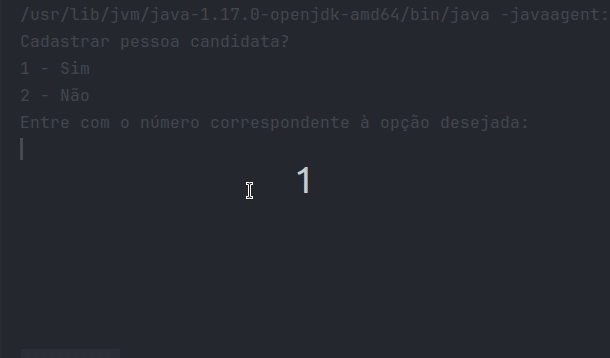

# :bar_chart: Sistema de Votação - Java e POO
Neste projeto foi desenvolvido um sistema de votação eletrônico que possibilite o cadastro de todas as pessoas candidatas e eleitoras, além de coordenar todo o processo de votação. Somado a isso, nesse sistema, é possível verificar os resultados da eleição a qualquer momento.

## ⚙️ Instalação das dependências
Para instalar as dependências do projeto, execute o comando `mvn install`. Isso fará o download das dependências configuradas no `pom.xml`, além de baixar as dependências indiretas.

## :white_check_mark: Funcionalidades Implementadas
### (1) Cadastro de pessoas candidatas

### (2) Cadastro de pessoas eleitoras

### (3) Iniciar o processo votação

### (4) Apresentar os resultados da eleição
 
## 💻 Visualize este projeto:
A classe Principal no arquivo `Principal.java` é a responsável por interagir com a pessoa usuária. Para testar a aplicação, basta executar esse módulo.

## 🧹 Linter (Checkstyle)
O Checkstyle é usado para fazer a análise estática do código. Este projeto já vem com as dependências relacionadas ao linter configuradas no arquivo `pom.xml`. Caso deseje rodar o Checkstyle manualmente, basta executar o comando `mvn checkstyle:check`.

## :information_source: Considerações finais
Este projeto é apenas para fins educacionais. Qualquer dúvida ou sugestão, sinta-se à vontade para entrar em contato.
